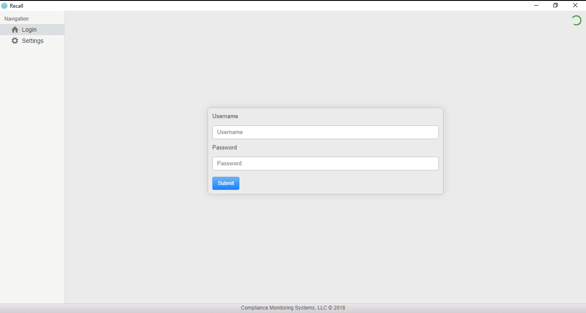
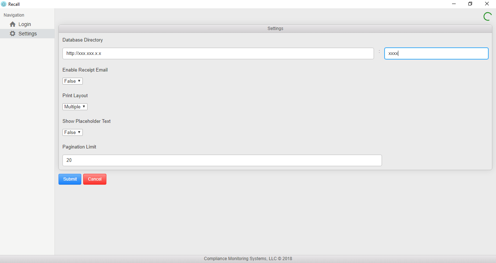
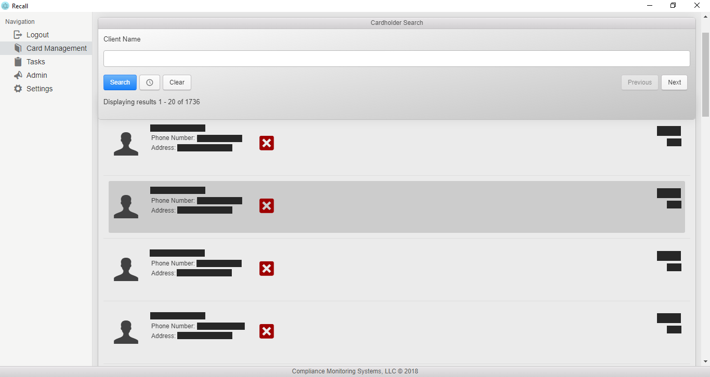
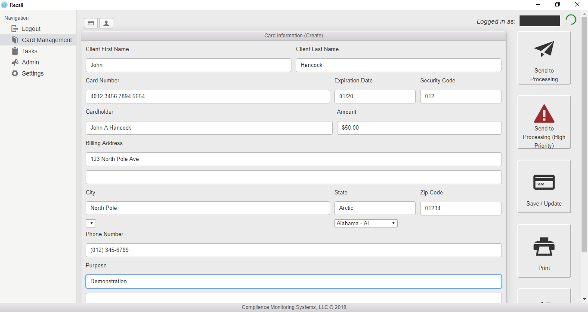

# Recall

Recall is a Windows program used to store encrypted client financial card data on a secure server. This project is uses the Electron boilerplate 'enhanced-electron-react-boilerplate' by Phillip Barbiero found [here](https://github.com/pbarbiero/enhanced-electron-react-boilerplate). Project styling uses 'Photon' found [here](http://photonkit.com).

## Screenshots
. | .
:-------------------------:|:-------------------------:
  |  
 | 

## Server Setup
- Step 1: Install [Node.js](https://nodejs.org/en/download/) on target system.
- Step 2: Install [MongoDB](https://www.npmjs.com/package/mongodb) by running command npm install mongodb.
- Step 3: Run command mongod enable middle-ware between server and MonboDB.
- Step 4: Download 'server' file from this project.
- Step 5: Navigate to server directory on target system via command line or terminal session.
- Step 6: In root directory run command 'npm install' to install all dependancies from associated 'package.json'.
- Step 7: Run command 'node index.js' to launch server. Server will be running on port 8081 by default.

Your back end server should now be up and running!

## Client Setup
- Step 1: Download installer [here](https://github.com/CMSDev2809/recall/releases/latest) titled 'Recall-Setup-latest.exe
' where latest is the current version number.
- Step 2: Run installer.
- Step 3: Once Recall has opened navigate to the 'Settings' option beneath the Navigation column and input the address & port number on which your server is running. Note that 

Recall should now be installed on your system! Recall automatically checks for updates on github on every startup and will automatically download and install them.
